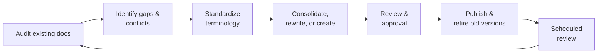

[README.md](https://github.com/user-attachments/files/32970288/README.md)
# Service Desk Documentation & Process Design Portfolio

A showcase of how I audit, design, and modernize operational documentation for an IT service desk: standard operating procedures (SOPs), workflows, quick-reference aids, role definitions, and training programs.

> **Confidentiality note:** This repository describes *what* each document was designed to do and *how* I approach the work. It intentionally contains **no** employer, client, vendor, personnel, contact, or environment-specific details. All templates and diagrams are original, generic examples.

---

## What this portfolio demonstrates

| Skill area | How it shows up |
| --- | --- |
| **Process analysis** | Auditing existing documentation for gaps, duplication, outdated terminology, and conflicts between documents |
| **Process design** | Building new SOPs and workflows from scratch where none existed, based on how work is actually performed |
| **Governance & document control** | Ownership, approval, versioning, revision history, and retirement of superseded documents |
| **Incident & escalation management** | ITIL-aligned procedures for major incidents, escalation handoffs, and impact communication |
| **Role & career architecture** | Tier responsibilities, career progression paths, and certification alignment by role |
| **Training design** | A structured, multi-week new-hire onboarding program |
| **Technical writing** | Writing for different audiences: full SOPs for reference, one-page quick references for use under pressure |

---

## Repository contents

| Path | What's inside |
| --- | --- |
| [`docs/case-study.md`](docs/case-study.md) | The documentation modernization project: the problem, approach, and outcomes |
| [`docs/document-catalog.md`](docs/document-catalog.md) | Every document type I produced and what it is designed to do |
| [`docs/methodology.md`](docs/methodology.md) | My repeatable framework for auditing and modernizing SOPs |
| [`docs/documentation-standards.md`](docs/documentation-standards.md) | The style and structure standards applied across all documents |
| [`templates/`](templates/) | Blank, reusable templates for SOPs, quick references, and workflows |
| [`diagrams/`](diagrams/) | Mermaid diagrams of the document lifecycle, audit process, and document hierarchy |

---

## Portfolio at a glance

**Scope of the project:** 15+ documents audited, consolidated, rewritten, or created across six categories:

1. Incident management
2. Ticket lifecycle & quality
3. Escalation & handoffs
4. Communication & notification
5. Roles, responsibilities & career development
6. Onboarding & training

See the [document catalog](docs/document-catalog.md) for what each one does.

---

## Frameworks & concepts applied

- **ITIL 4** practices: incident management, major incident management, service request handling, knowledge management
- **Tiered support model** design (L1 / L2 / engineering escalation)
- **Document control** principles: single source of truth, version control, defined ownership, scheduled review
- **Governance thinking** from a cybersecurity and GRC background: clear accountability, auditability, and consistency across controls

---

## Using the templates

The files in [`templates/`](templates/) are free to reuse. Copy one, replace the bracketed placeholders, and delete any section that doesn't apply.

---

## About me

IT service desk professional with a B.S. in Cybersecurity and Information Assurance, focused on governance, risk, and compliance (GRC) and on building the processes and documentation that make operations consistent and auditable.

- LinkedIn: [linkedin.com/in/brentpetty](https://linkedin.com/in/brentpetty)
- Contact: [brentpetty@comcast.net](mailto:brentpetty@comcast.net)
