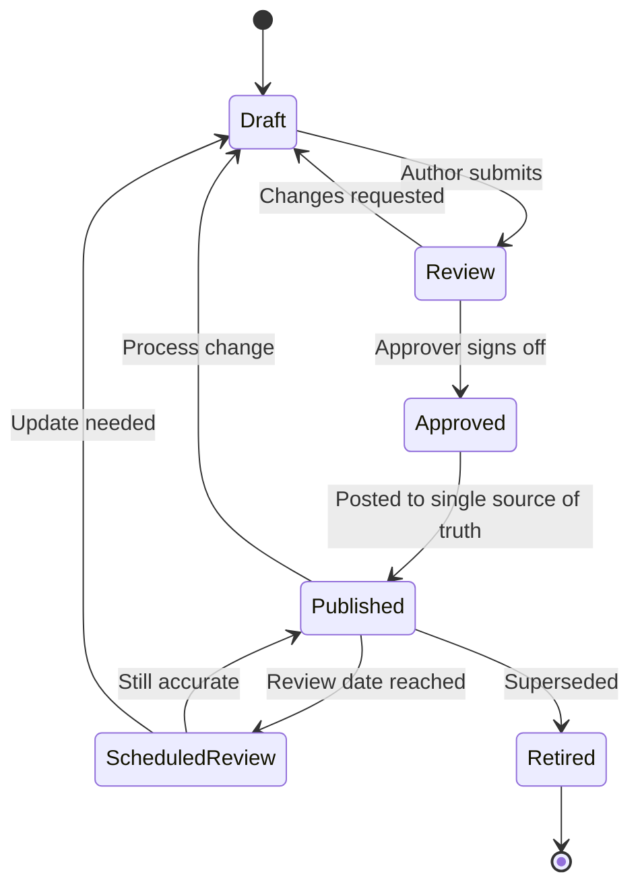
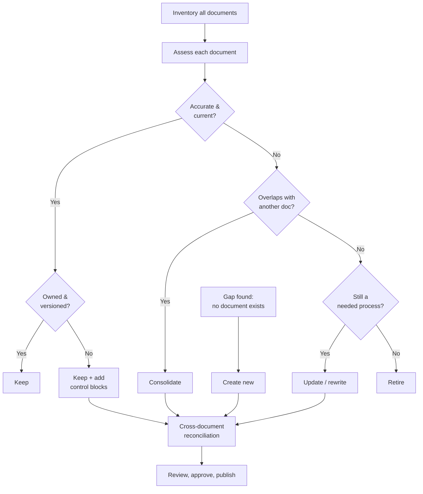
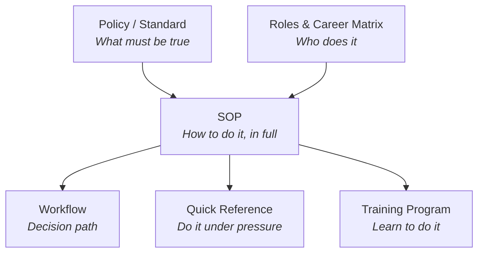
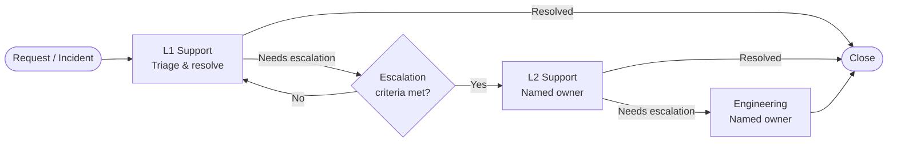

# Diagrams

Generic, illustrative diagrams of how I approach documentation work. GitHub renders Mermaid automatically.

---

## 1. Document lifecycle

---

## 2. Audit & disposition process

---

## 3. Documentation hierarchy

How the document types relate, from broad to specific.

---

## 4. Generic tiered escalation model

An illustrative, industry-standard model. It does not represent any specific organization's procedure.

> **Design principle:** every escalation is a direct handoff to a named owner, and the ticket's documentation must be complete before it moves.
