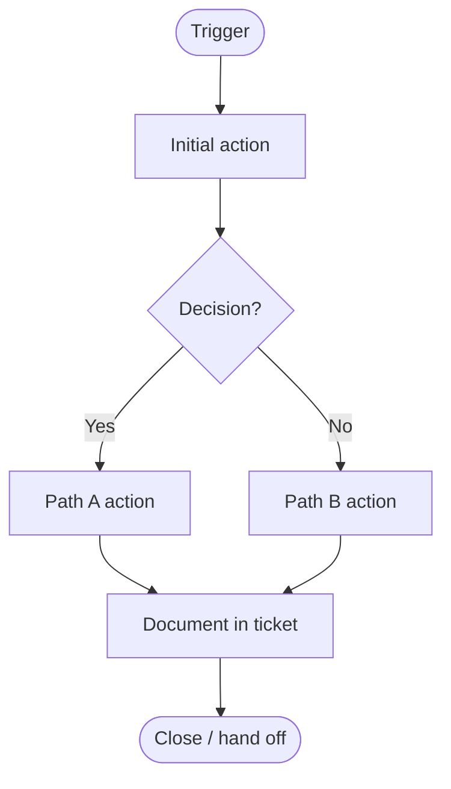

> **Classification:** [Internal Use Only] · **Full SOP:** [link]

# [Process Name] Workflow

**Trigger:** [What starts this workflow]
**Owner:** [Role responsible for starting it]
**Outcome:** [What "done" looks like]

## Flow

## Step detail
| # | Step | Owner | Notes |
| --- | --- | --- | --- |
| 1 | [Step] | [Role] | [Key detail] |
| 2 | [Step] | [Role] | [Key detail] |
| 3 | [Step] | [Role] | [Key detail] |

## Handoff criteria
Before handing off to the next role, confirm:
- [ ] [Information captured]
- [ ] [Troubleshooting documented]
- [ ] [Customer updated]

## Revision History
| Version | Date | Author | Summary |
| --- | --- | --- | --- |
| 1.0 | [MM/DD/YYYY] | [Name] | Initial release |
